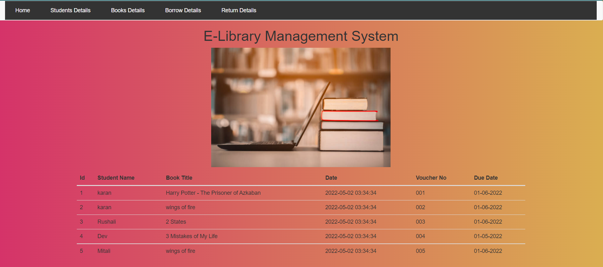

# e-lib
E-Library Management System

 

`Install Required Libraries`
- pip install -r requirements.txt

`Create Database Schema`
- Run the elib-sql-schema.sql file in sql.

`How to Run the E-Lib Server Code:`

1.) Open the command prompt in the same window and run the command in step 2.
2.) python app.py
3.) Open any web browser
4.) Write the following address in the address bar:
    127.0.0.1:5000

`Basic Requirement to Run the project into a system.`

1.) Python3 must be installed in the system.
2.) MYSQL Database must be installed in the system.
3.) Any Web Browser must be installed in the system.

